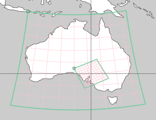

odc.geo
#######

|Documentation Status| |Test Status| |Test Coverage|

This library combines geometry shape classes from shapely_ with CRS from pyproj_ to provide
projection aware ``Geometry``. It exposes all the functionality provided by ``shapely`` modules, but
will refuse operations between geometries defined in different projections. Geometries can be
brought into a common projection with ``Geometry.to_crs`` method.

Based on that foundation a number of data types and utilities useful for working with geospatial
metadata are implemented. Of particular importance is ``GeoBox``. It is an abstraction for a
geo-registered bounded pixel plane where a linear mapping from pixel coordinates to the real world
is defined.

To make working with geo-registered raster data easier an integration with xarray_ is provided.
Importing ``odc.geo.xr`` enables ``.odc.`` accessor on every ``xarray.Dataset`` and
``xarray.DataArray`` that exposes geospatial information of the raster loaded with `Open Datacube`_
or rioxarray_. Methods for attaching geospatial information to xarray objects in a robust way are
also provided. Geospatial information attached in this way survives most operations you might do on
the data: basic mathematical operations, type conversions, cropping, serialization to most formats
like zarr, netcdf, GeoTIFF.

For more details see Documentation_.

Origins
=======

This repository contains geometry related code extracted from `Open Datacube`_.

For details and motivation see `ODC-EP-06`_ enhancement proposal.

.. |Documentation Status| image:: https://readthedocs.org/projects/odc-geo/badge/?version=latest
   :target: https://odc-geo.readthedocs.io/en/latest/?badge=latest
   :alt: Documentation Status

.. |Test Status| image:: https://github.com/opendatacube/odc-geo/actions/workflows/main.yml/badge.svg
   :target: https://github.com/opendatacube/odc-geo/actions/workflows/main.yml
   :alt: Test Status

.. |Test Coverage| image:: https://codecov.io/gh/opendatacube/odc-geo/branch/develop/graph/badge.svg?token=Qc7isqXNGF
   :target: https://codecov.io/gh/opendatacube/odc-geo
   :alt: Test Coverage

.. _rioxarray: https://corteva.github.io/rioxarray/stable/
.. _xarray: https://docs.xarray.dev/en/stable/
.. _shapely: https://shapely.readthedocs.io/en/stable/manual.html
.. _pyproj: https://pyproj4.github.io/pyproj/stable/
.. _`Open Datacube`: https://github.com/opendatacube/datacube-core
.. _`ODC-EP-06`: https://github.com/opendatacube/datacube-core/wiki/ODC-EP-06---Extract-Geometry-Utilities-into-a-Separate-Package
.. _`Documentation`: https://odc-geo.readthedocs.io/